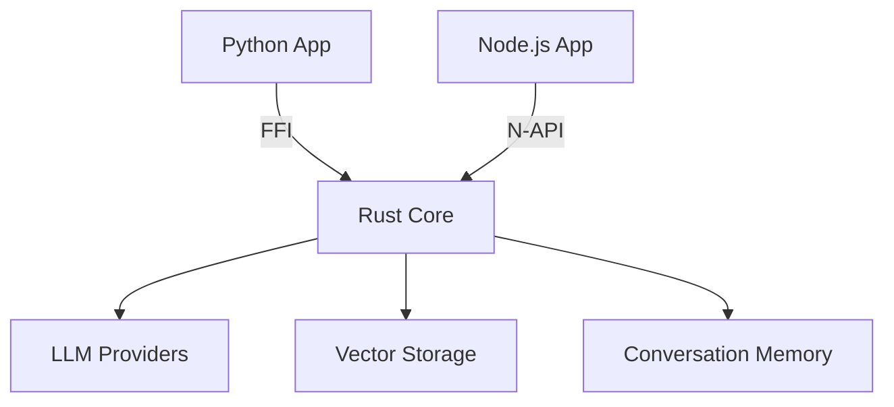

# Architecture

Mini_LangChain is designed for maximum throughput and minimum latency in cross-language environments.

## The Core Concept
Most LLM frameworks (like the original LangChain) are built primarily in Python. While expressive, these frameworks incur significant overhead in high-concurrency production environments due to the Global Interpreter Lock (GIL) and high-level object overhead.

**Mini_LangChain** moves the entire orchestration logic—prompt management, memory handling, vector similarity search, and provider communication—into a single, highly optimized **Rust Core**.

## Multi-Language Bridges
We use modern, zero-overhead bridges to expose the Rust core to other ecosystems:
- **PyO3**: For Python bindings.
- **Napi-rs**: For Node.js bindings.

## Performance Highlights
1. **Token Minification**: Internal buffers use optimized string management to minimize allocations during prompt construction.
2. **Parallel Similarity Search**: The `InMemoryVectorStore` leverages Rust's safe concurrency (Rayon/Tokio) for search operations.
3. **Zero-Copy Data**: Where possible, data is passed between the bridge and the core without redundant serialization.
